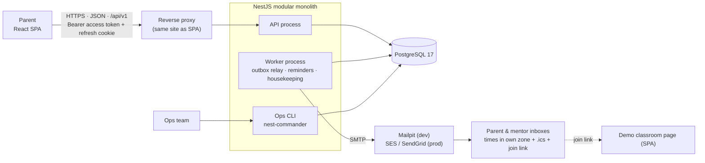
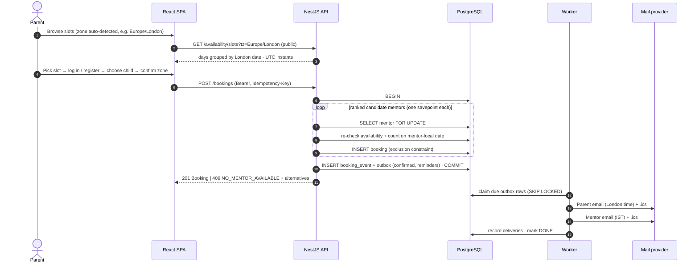
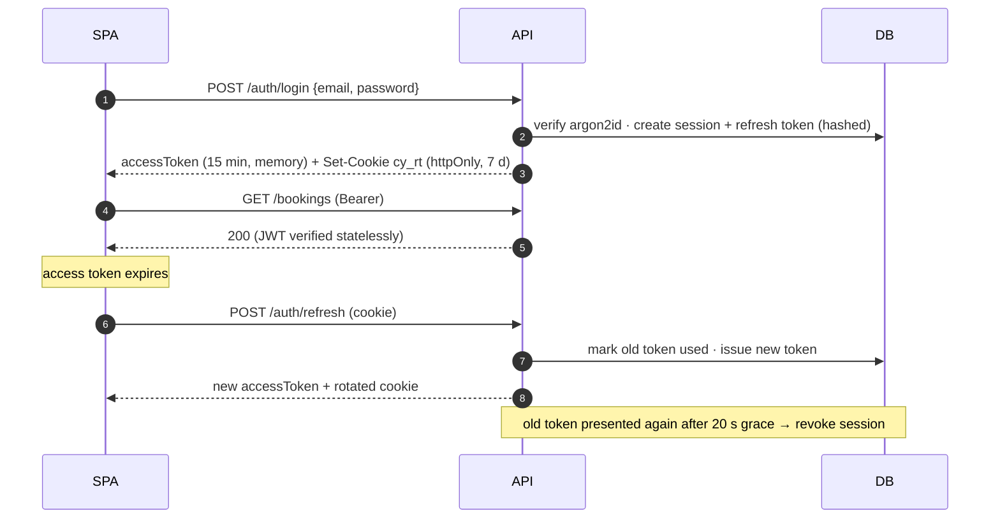

# 02 — System Architecture

> Status: **Final for MVP.**

## 1. Architectural style: modular monolith, three entry points

At 20 bookings/day, microservices would add operational cost with no benefit. We build a
**NestJS modular monolith** with strict module boundaries (each module owns its tables and exposes
services), run as **three entry points from one codebase**:

- **API** — HTTP (`/api/v1/**`).
- **Worker** — transactional-outbox relay (emails), reminders, housekeeping.
- **Ops CLI** — operational commands (mentors, availability, reassignment, failed emails).

HTTP latency stays independent of email delivery; API and worker scale separately; any module can be
extracted later if a real need appears.



### Why Postgres carries the correctness

- `timestamptz` + `tstzrange` model class times precisely.
- An **exclusion constraint** (`btree_gist`) makes overlapping classes for one mentor impossible.
- Row locks (`SELECT … FOR UPDATE`) serialise capacity-consuming writes per mentor → daily cap holds.
- The **outbox table** is a durable queue, written atomically with the business change — no Redis.

## 2. Repository layout (npm workspaces)

```
.
├── package.json                   # "workspaces": ["apps/*", "packages/*"]
├── apps/
│   ├── api/
│   │   ├── src/
│   │   │   ├── main.ts            # HTTP entry
│   │   │   ├── worker.ts          # worker entry
│   │   │   ├── cli.ts             # ops CLI entry
│   │   │   ├── api.module.ts · worker.module.ts · cli.module.ts
│   │   │   ├── config/            # zod-validated env
│   │   │   ├── common/            # problem+json filter, guards, decorators, pipes, logging, clock
│   │   │   ├── database/          # data-source.ts, migrations/, seed/
│   │   │   └── modules/
│   │   │       ├── auth/ · users/ · students/
│   │   │       ├── mentors/ · availability/ · bookings/
│   │   │       ├── classroom/ · notifications/ · waitlist/
│   │   │       ├── health/
│   │   │       └── ops-cli/
│   │   └── test/                  # integration + e2e (Testcontainers)
│   └── web/                       # React + Vite SPA
├── packages/
│   ├── contracts/                 # zod schemas + TS types shared by api & web
│   └── time/                      # Temporal-based zone/DST utilities shared by api & web
├── docs/
├── docker-compose.yml             # postgres, mailpit (infra for local dev)
└── .github/workflows/ci.yml
```

## 3. Tech stack

| Layer | Choice | Why |
|-------|--------|-----|
| Runtime | Node 22 LTS, TypeScript strict | LTS; available locally. |
| Monorepo | npm workspaces | Built in, no extra tooling. |
| Backend | NestJS 11 | DI + modules map to bounded contexts. |
| DB | PostgreSQL 17 | `btree_gist`, `citext`, `tstzrange`, `SKIP LOCKED`. |
| ORM | TypeORM + `@nestjs/typeorm` (rules in doc 03 §2) | Official Nest integration; migrations reviewed by hand; raw SQL where it matters. |
| Validation | zod + `nestjs-zod` | One schema language shared with the frontend. |
| Auth | `@nestjs/jwt`, `argon2`, opaque rotating refresh tokens | Standard, revocable, no Passport indirection needed. |
| Time | Temporal API via `temporal-polyfill`, wrapped in `packages/time` | Explicit DST disambiguation. |
| Jobs | Outbox table + worker (own `JobScheduler` inside the worker only, PD-34) | Atomic with business writes; no Redis. |
| Email | Nodemailer + Handlebars + `juice` + `ics` | Provider-agnostic; Mailpit locally. |
| CLI | `nest-commander` | Reuses the same services & DI graph. |
| Logging | `nestjs-pino` | JSON, request-id correlation, PII redaction. |
| API docs | `@nestjs/swagger` (+ zod → OpenAPI) | `/api/docs`. |
| Hardening | `helmet`, `@nestjs/throttler`, CORS allow-list, `cookie-parser` | Baseline for a public app. |
| Health | `@nestjs/terminus` | Liveness/readiness. |
| Testing | Vitest (+ `unplugin-swc` for decorators), Supertest, Testcontainers | Real Postgres for concurrency and constraint tests. |
| Frontend | React 19 + Vite, React Router, TanStack Query, zustand, RHF + zod, Tailwind v4 + Base UI + cva, Sonner, Phosphor | See docs 05 and 07. |
| Local infra | Docker Compose: Postgres 17, Mailpit | `docker compose up -d`. |
| CI | GitHub Actions | lint → typecheck → unit → integration → e2e → build; migration drift check; TZ matrix. |

## 4. Key flows

### 4.1 Booking



### 4.2 Auth session lifecycle



### 4.3 Notification pipeline

1. Domain event written to `outbox_messages` **in the same transaction** as the state change.
2. Worker claims due rows, loads current state, renders one email per recipient in their zone.
3. `email_deliveries` unique key prevents re-sending after partial failures.
4. Exponential backoff; `DEAD` after 8 attempts; ops can list/retry via CLI.
5. Reminders are outbox rows scheduled at `start − 24h` / `start − 1h`; skipped if the booking changed.

## 5. Cross-cutting concerns

| Concern | Approach |
|---------|----------|
| Config | zod-validated env; boot fails on invalid config; business knobs are config and exposed via `/meta/booking-config`. |
| Errors | Typed domain errors → one `ProblemDetailsFilter` → RFC 7807 with stable `code` + `traceId`. |
| Logging | Pino JSON; `x-request-id`; emails/tokens/passwords redacted; security events (lockout, token reuse) logged at `warn`. |
| Security | Secure-by-default global JWT guard; argon2id; stateless 15-min access JWTs; rotating refresh tokens with reuse detection; rate limits + lockout; Helmet; CORS allow-list; SameSite=Strict cookie + custom header on cookie endpoints; owner-scoped queries; parameterised SQL only. |
| Time | `TZ=UTC` processes + DB sessions; all conversions via `packages/time`; injectable `Clock` for tests. |
| Audit | Append-only `booking_events` with actor. |
| API evolution | URL-versioned `/api/v1`; shared contracts package. |

## 6. Environments & deployment

- **Local**: `docker compose up -d` (Postgres, Mailpit) → `npm run db:migrate` → `npm run cli -- db:seed`
  → `npm run dev` (API + worker + web in parallel). Mailpit UI at `localhost:8025`. Or the whole
  product without Node: `docker compose --profile app up --build` (http://localhost:8080).
- **CI**: Testcontainers Postgres and Mailpit; Playwright against built apps; both Docker images built.
- **Production (suggested)**: the root multi-stage Dockerfile (`api` image for API, worker and CLI;
  `web` image on Caddy); API and worker as separate services; migrations
  as a one-off release task; managed Postgres with PITR; SES; SPA and API behind one domain
  (CDN/reverse proxy, `/api` → API) so the refresh cookie stays same-site; secrets from the platform store.

## 7. Architecture Decision Records

Recorded in [`docs/adr/`](adr/README.md): 0001 modular monolith · 0002 UTC instants + IANA zones ·
0003 Temporal · 0004 DB-enforced invariants · 0005 transactional outbox · 0006 TypeORM rules ·
0007 JWT + rotating refresh tokens · 0008 ops CLI · 0009 shared zod contracts · 0010 npm workspaces ·
0011 assignment strategy · 0012 public browsing, account to book · 0013 no slot holds ·
0014 Base UI + CSS-only motion · 0015 design system as source of truth · 0016 Figtree ·
0017 canonical zone ids at boundaries.
