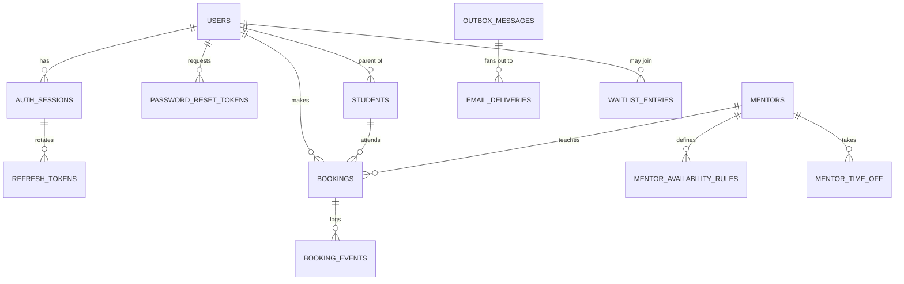
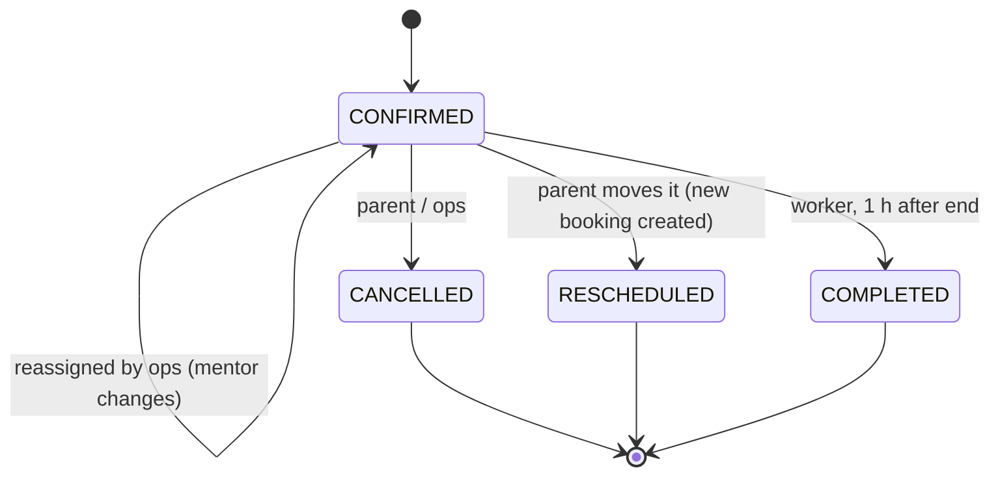

# 03 — Backend Design (NestJS + TypeORM + PostgreSQL)

> Status: **Final for MVP.**

## 1. Module map

| Module | Owns (tables) | Responsibilities |
|--------|---------------|------------------|
| `users` | `users` | Parent profile (name, phone, zone), password hashing service. |
| `auth` | `auth_sessions`, `refresh_tokens`, `password_reset_tokens` | Register, login, refresh rotation, logout, forgot/reset/change password, JWT guard, lockout. |
| `students` | `students` | Parent's children. |
| `mentors` | `mentors`, `mentor_availability_rules`, `mentor_time_off` | Mentor data + availability (written by ops CLI only in MVP). |
| `availability` | *(read model)* | **Slot engine** (pure) + slots API. |
| `bookings` | `bookings`, `booking_events` | Create / list / cancel / reschedule / reassign; assignment strategy; idempotency; state machine. |
| `classroom` | *(read model)* | `MeetingProvider` (dummy) + join-token lookup. |
| `notifications` | `outbox_messages`, `email_deliveries` | Outbox writer (in-transaction), worker relay, templates, `.ics`, SMTP transport. |
| `waitlist` | `waitlist_entries` | Capture demand when the horizon is full. |
| `health` | — | `/health/live`, `/health/ready`. |
| `ops-cli` | — | `nest-commander` commands wrapping the services above. |

Module internals:

```
bookings/
├── bookings.module.ts
├── http/            # controllers + DTOs (zod schemas from @app/contracts)
├── application/     # use cases: CreateBooking, CancelBooking, RescheduleBooking, ReassignBooking, ListBookings
├── domain/          # pure TS: booking state machine, AssignmentStrategy, domain errors
└── infra/           # TypeORM entities + repositories (incl. raw SQL for locking queries)
```

`domain/` never imports Nest or TypeORM and is unit-tested in isolation.

### Three entry points, one codebase

| Entry | Bootstrap | Runs |
|-------|-----------|------|
| `src/main.ts` | `NestFactory.create(ApiModule)` | HTTP API |
| `src/worker.ts` | `NestFactory.createApplicationContext(WorkerModule)` | Outbox relay, reaper, housekeeping (`JobScheduler`, only in this process) |
| `src/cli.ts` | `CommandFactory.run(CliModule)` | Ops commands (`npm run cli -- <command>`) |

### Request pipeline

`x-request-id` middleware → Helmet → CORS (allow-list) → `ThrottlerGuard` → global `JwtAuthGuard`
(secure by default; `@Public()` opts out) → `ZodValidationPipe` → controller → application service →
`ProblemDetailsFilter` (all errors → RFC 7807).

## 2. Persistence with TypeORM — ground rules

| Rule | Why |
|------|-----|
| `synchronize: false`, `migrationsRun: false`, `installExtensions: false`. Migrations run as an explicit deploy step (`npm run db:migrate`, history in `schema_migrations`), each in its own transaction. | Never let the ORM mutate prod schema implicitly. |
| Migrations are generated, then **reviewed and hand-edited**. Extensions, the exclusion constraint and CHECKs live in hand-written SQL inside migrations. | TypeORM's diffing is noisy; SQL is the source of truth. |
| Entities still declare `@Exclusion`, `@Check`, `@Index({ where })` (and `@ForeignKey` instead of relations) so the generator sees no drift; indexes the decorators cannot express (expressions, `DESC`) are `synchronize: false`. The integration suite fails on drift (TypeORM's schema builder must have nothing to do after the migrations), and `npm run db:drift` runs the same check against any database. | Keeps entities and DB in sync. |
| Status fields are `text` + `CHECK (… IN …)`, not Postgres enums. | TypeORM migrates enum changes by drop/recreate; CHECK constraints change cleanly. |
| `SnakeNamingStrategy` (our own, `database/snake-naming.strategy.ts`: `typeorm-naming-strategies` does not support TypeORM 1.x). Constraint names follow PostgreSQL's defaults (`users_pkey`, `bookings_mentor_id_fkey`, `users_email_key`); checks, exclusions and partial indexes are named explicitly. | `snake_case` in SQL, `camelCase` in TS; stable names for the drift check. |
| No eager/lazy relations, no cascades. Joins are explicit in repositories. | Predictable queries, no N+1 surprises. |
| Repositories are our own classes built from an `EntityManager` (`repo.withManager(em)`); services never touch `DataSource` directly except to open a transaction. | Transaction is always passed explicitly — no hidden ambient state. |
| Locking/performance-critical queries use QueryBuilder or parameterised raw SQL inside repositories. | Clarity over ORM gymnastics. |
| `timestamptz` ↔ `Date` at the ORM edge, converted to `Temporal.Instant` in repositories; `date` columns stay `YYYY-MM-DD` strings; `bigint` as string. | No implicit local-time conversions. |
| DB session `timezone = 'UTC'`, `maxQueryExecutionTime` 200 ms → slow-query warning in logs. | Time safety + observability. |

## 3. Data model

PostgreSQL 17 · extensions `pgcrypto`, `citext`, `btree_gist`.



### 3.1 Identity & auth

```sql
CREATE TABLE users (
  id                     uuid PRIMARY KEY DEFAULT gen_random_uuid(),
  email                  citext      NOT NULL UNIQUE,
  password_hash          text        NOT NULL,                 -- argon2id PHC string
  full_name              text        NOT NULL,
  phone                  text,
  timezone               text        NOT NULL,                 -- IANA
  role                   text        NOT NULL DEFAULT 'PARENT' CHECK (role IN ('PARENT')),  -- extensible
  failed_login_attempts  int         NOT NULL DEFAULT 0,
  failed_login_window_started_at timestamptz,                  -- first failure of the lockout window
  locked_until           timestamptz,
  password_changed_at    timestamptz NOT NULL DEFAULT now(),
  last_login_at          timestamptz,
  created_at             timestamptz NOT NULL DEFAULT now(),
  updated_at             timestamptz NOT NULL DEFAULT now()
);

CREATE TABLE auth_sessions (                       -- one per login ("refresh token family")
  id            uuid PRIMARY KEY DEFAULT gen_random_uuid(),   -- = `sid` claim in access JWT
  user_id       uuid        NOT NULL REFERENCES users(id) ON DELETE CASCADE,
  created_at    timestamptz NOT NULL DEFAULT now(),
  last_used_at  timestamptz NOT NULL DEFAULT now(),
  expires_at    timestamptz NOT NULL,                          -- absolute cap (30 d)
  revoked_at    timestamptz,
  revoke_reason text CHECK (revoke_reason IN ('LOGOUT','PASSWORD_CHANGED','PASSWORD_RESET','REUSE_DETECTED')),
  user_agent    text,
  ip            inet
);
CREATE INDEX auth_sessions_user_active ON auth_sessions (user_id) WHERE revoked_at IS NULL;

CREATE TABLE refresh_tokens (
  id          uuid PRIMARY KEY DEFAULT gen_random_uuid(),
  session_id  uuid        NOT NULL REFERENCES auth_sessions(id) ON DELETE CASCADE,
  token_hash  bytea       NOT NULL UNIQUE,                     -- sha256(opaque token)
  expires_at  timestamptz NOT NULL,                            -- 7 d
  used_at     timestamptz,                                     -- set on rotation
  created_at  timestamptz NOT NULL DEFAULT now()
);

CREATE TABLE password_reset_tokens (
  id          uuid PRIMARY KEY DEFAULT gen_random_uuid(),
  user_id     uuid        NOT NULL REFERENCES users(id) ON DELETE CASCADE,
  token_hash  bytea       NOT NULL UNIQUE,
  expires_at  timestamptz NOT NULL,                            -- 30 min
  used_at     timestamptz,
  created_at  timestamptz NOT NULL DEFAULT now()
);
```

### 3.2 Domain

```sql
CREATE TABLE students (
  id         uuid PRIMARY KEY DEFAULT gen_random_uuid(),
  parent_id  uuid     NOT NULL REFERENCES users(id) ON DELETE CASCADE,
  first_name text     NOT NULL,
  age        smallint NOT NULL CHECK (age BETWEEN 4 AND 18),
  created_at timestamptz NOT NULL DEFAULT now()
);
CREATE UNIQUE INDEX students_parent_name ON students (parent_id, lower(first_name));

CREATE TABLE mentors (
  id                 uuid PRIMARY KEY DEFAULT gen_random_uuid(),
  full_name          text     NOT NULL,
  email              citext   NOT NULL UNIQUE,
  timezone           text     NOT NULL,
  max_trials_per_day smallint NOT NULL DEFAULT 2 CHECK (max_trials_per_day > 0),
  is_active          boolean  NOT NULL DEFAULT true,
  last_assigned_at   timestamptz,
  created_at         timestamptz NOT NULL DEFAULT now(),
  updated_at         timestamptz NOT NULL DEFAULT now()
);

CREATE TABLE mentor_availability_rules (          -- wall-clock, in the mentor's zone
  id             uuid PRIMARY KEY DEFAULT gen_random_uuid(),
  mentor_id      uuid     NOT NULL REFERENCES mentors(id) ON DELETE CASCADE,
  weekday        smallint NOT NULL CHECK (weekday BETWEEN 1 AND 7),   -- ISO, 1 = Monday
  start_local    time     NOT NULL,
  end_local      time     NOT NULL,                                   -- end <= start ⇒ crosses midnight
  effective_from date     NOT NULL,
  effective_to   date,
  CHECK (start_local <> end_local),
  CHECK (effective_to IS NULL OR effective_to >= effective_from)
);

CREATE TABLE mentor_time_off (
  id         uuid PRIMARY KEY DEFAULT gen_random_uuid(),
  mentor_id  uuid        NOT NULL REFERENCES mentors(id) ON DELETE CASCADE,
  starts_at  timestamptz NOT NULL,
  ends_at    timestamptz NOT NULL CHECK (ends_at > starts_at),
  reason     text
);

CREATE TABLE bookings (
  id                   uuid PRIMARY KEY DEFAULT gen_random_uuid(),
  reference            text        NOT NULL UNIQUE,              -- 'CY-7K3Q9P' (Crockford base32)
  parent_id            uuid        NOT NULL REFERENCES users(id),
  student_id           uuid        NOT NULL REFERENCES students(id),
  mentor_id            uuid        NOT NULL REFERENCES mentors(id),
  starts_at            timestamptz NOT NULL,
  ends_at              timestamptz NOT NULL,
  blocked_until        timestamptz NOT NULL,                     -- ends_at + buffer
  mentor_local_date    date        NOT NULL,                     -- cap bucket (A-1)
  parent_timezone      text        NOT NULL,                     -- snapshot at booking time
  mentor_timezone      text        NOT NULL,                     -- snapshot at booking time
  status               text        NOT NULL DEFAULT 'CONFIRMED'
                       CHECK (status IN ('CONFIRMED','CANCELLED','RESCHEDULED','COMPLETED')),
  cancelled_by         text        CHECK (cancelled_by IN ('PARENT','OPS')),
  cancel_reason        text,
  cancelled_at         timestamptz,
  rescheduled_from_id  uuid        REFERENCES bookings(id),
  parent_join_token    text        NOT NULL UNIQUE,
  mentor_join_token    text        NOT NULL UNIQUE,
  meeting_url          text        NOT NULL,
  ics_sequence         int         NOT NULL DEFAULT 0,           -- bumps on any change → calendars update
  idempotency_key      text,
  request_fingerprint  text,                                     -- sha256 of canonical request body
  created_at           timestamptz NOT NULL DEFAULT now(),
  updated_at           timestamptz NOT NULL DEFAULT now(),
  CHECK (ends_at > starts_at AND blocked_until >= ends_at),
  UNIQUE (parent_id, idempotency_key),

  CONSTRAINT bookings_no_mentor_overlap EXCLUDE USING gist (
    mentor_id WITH =,
    tstzrange(starts_at, blocked_until, '[)') WITH &&
  ) WHERE (status = 'CONFIRMED')
);

CREATE UNIQUE INDEX bookings_one_upcoming_per_student ON bookings (student_id) WHERE status = 'CONFIRMED';
CREATE INDEX bookings_mentor_day ON bookings (mentor_id, mentor_local_date) WHERE status = 'CONFIRMED';
CREATE INDEX bookings_confirmed_start ON bookings (starts_at) WHERE status = 'CONFIRMED';
CREATE INDEX bookings_parent_start ON bookings (parent_id, starts_at DESC);

CREATE TABLE booking_events (                      -- append-only audit trail
  id         bigserial PRIMARY KEY,
  booking_id uuid        NOT NULL REFERENCES bookings(id),
  type       text        NOT NULL,   -- CREATED, CANCELLED, RESCHEDULED_FROM, RESCHEDULED_TO, REASSIGNED, COMPLETED
  actor      text        NOT NULL,   -- 'parent:<uuid>' | 'ops:<os-user>' | 'system'
  payload    jsonb       NOT NULL DEFAULT '{}',
  created_at timestamptz NOT NULL DEFAULT now()
);
CREATE INDEX booking_events_booking ON booking_events (booking_id, id);
```

### 3.3 Messaging & waitlist

```sql
CREATE TABLE outbox_messages (
  id           bigserial PRIMARY KEY,
  type         text        NOT NULL,   -- BookingConfirmed | BookingCancelled | BookingRescheduled | BookingReassigned
                                       -- | BookingReminder | PasswordResetRequested | PasswordChanged
  payload      jsonb       NOT NULL,
  status       text        NOT NULL DEFAULT 'PENDING' CHECK (status IN ('PENDING','PROCESSING','DONE','DEAD')),
  attempts     int         NOT NULL DEFAULT 0,
  run_after    timestamptz NOT NULL DEFAULT now(),
  locked_at    timestamptz,
  last_error   text,
  created_at   timestamptz NOT NULL DEFAULT now(),
  processed_at timestamptz
);
CREATE INDEX outbox_due ON outbox_messages (run_after) WHERE status = 'PENDING';

CREATE TABLE email_deliveries (
  id                  uuid PRIMARY KEY DEFAULT gen_random_uuid(),
  outbox_message_id   bigint NOT NULL REFERENCES outbox_messages(id),
  template            text   NOT NULL,
  recipient_email     citext NOT NULL,
  recipient_timezone  text   NOT NULL,
  booking_id          uuid   REFERENCES bookings(id),
  provider_message_id text,
  sent_at             timestamptz,
  UNIQUE (outbox_message_id, template, recipient_email)   -- no re-send on retry
);

CREATE TABLE waitlist_entries (
  id              uuid PRIMARY KEY DEFAULT gen_random_uuid(),
  user_id         uuid   REFERENCES users(id) ON DELETE SET NULL,
  full_name       text   NOT NULL,
  email           citext NOT NULL,
  timezone        text   NOT NULL,
  preferred_times text,
  status          text   NOT NULL DEFAULT 'OPEN' CHECK (status IN ('OPEN','CONTACTED','CLOSED')),
  created_at      timestamptz NOT NULL DEFAULT now()
);
CREATE UNIQUE INDEX waitlist_one_open_per_email ON waitlist_entries (email) WHERE status = 'OPEN';
```

### 3.4 Invariants and enforcement

| Invariant | Enforced by |
|-----------|-------------|
| No overlapping classes per mentor (incl. buffer) | Exclusion constraint. |
| ≤ `max_trials_per_day` per mentor-local date | Mentor row lock (`FOR UPDATE`) + count in the same transaction. Every **capacity-consuming** write (create, reschedule, reassign, time-off/availability change) takes the lock. Capacity-releasing writes (cancel) don't need it — they can never break the cap. |
| One upcoming trial per child | Partial unique index. |
| Idempotent booking | `UNIQUE (parent_id, idempotency_key)`. |
| No duplicate email per event/recipient | `email_deliveries` unique key. |
| One open waitlist entry per email | Partial unique index. |
| Valid zones | Validated by Intl acceptance and canonicalised to the current IANA name at the API/CLI boundary (`IanaZoneSchema`, ADR 0017). |

## 4. Slot engine (availability)

Pure function in `availability/domain`, no I/O:

```
computeSlots({ range, now, config, mentors: [{ id, tz, maxPerDay, rules, timeOff, bookings }] })
  → Map<slotStartInstant, eligibleMentorIds[]>
```

1. **Expand rules → instants.** For each mentor-local date overlapping the range (±1 day), for each
   matching rule, convert `(date, start_local)` / `(date or date+1, end_local)` in the mentor's zone
   to instants with the DST policy (doc 04).
2. **Subtract** time off and each confirmed booking's `[starts_at, blocked_until)`.
3. **Discretise** on the UTC grid: slot `[t, t+60)` is valid if `[t, t+60+buffer)` fits in a free interval.
   Together with step 2 this is exactly the `bookings_no_mentor_overlap` rule (the new booking's
   `[t, blocked_until)` may not meet an existing one), so the engine and the database never disagree.
4. **Cap**: drop a mentor's slots on any mentor-local date where confirmed count ≥ cap.
5. **Lead time / horizon** filter against server `now`.
6. **Union** across mentors.

The HTTP layer groups by the requester's local date, sets day status (`AVAILABLE`, `FULLY_BOOKED`,
`NO_AVAILABILITY`), `nextAvailable` (searches past the requested window up to the horizon) and DST
transitions in range. Mentor identities never leave the server. Day status is judged on the bookable
part of the day: mentors scheduled after the lead time but every slot taken (bookings or cap) is
`FULLY_BOOKED`; no scheduled mentor time (none planned, time off, or only inside the lead time) is
`NO_AVAILABILITY`. `from` may be at most one day before today and at most the horizon ahead (in `tz`,
by the server clock); anything else is `400 VALIDATION_FAILED`.

Scale note: 10 mentors × 14 days is trivial per request. At 100×: cache per (date) invalidated by
booking/availability events, or materialise free slots.

## 5. Bookings

### 5.1 Create

```ts
async create(parentId, cmd, idempotencyKey): Promise<Booking> {
  // 0. Idempotency: existing (parentId, key)?
  //      same fingerprint → return it (200); different → 422 IDEMPOTENCY_KEY_REUSED.
  // 1. Validate zone, grid alignment, lead time, horizon.
  // 2. Candidates = slot engine for this one slot; none → 409 NO_MENTOR_AVAILABLE + alternatives.
  // 3. ranked = assignmentStrategy.rank(slot, candidates)
  return dataSource.transaction(async (em) => {
    await em.query(`SET LOCAL lock_timeout = '3s'`);
    const student = await students.withManager(em).resolve(parentId, cmd.student); // existing id or create inline
    await users.withManager(em).syncTimezone(parentId, cmd.timezone);

    for (const c of ranked) {
      await em.query('SAVEPOINT candidate');
      const m = await mentors.withManager(em).lockById(c.id);          // SELECT … FOR UPDATE
      const ok = m.isActive
        && await availability.isFreeUnderLock(em, m, slot)            // re-check rules, time off, overlap
        && await bookingsRepo.withManager(em).countConfirmed(m.id, localDate(slot, m.tz)) < m.maxTrialsPerDay;
      if (!ok) { await em.query('ROLLBACK TO SAVEPOINT candidate'); continue; } // releases the lock

      try {
        const booking = await bookingsRepo.withManager(em).insert({ ... });   // may hit exclusion (23P01)
        await events.append(em, booking, 'CREATED', actor);
        await outbox.enqueue(em, 'BookingConfirmed', { bookingId: booking.id });
        await outbox.enqueue(em, 'BookingReminder', { bookingId: booking.id, kind: '24h' }, slot.start.minus(24h));
        await outbox.enqueue(em, 'BookingReminder', { bookingId: booking.id, kind: '1h'  }, slot.start.minus(1h));
        await mentors.withManager(em).touchLastAssigned(m.id);
        return booking;
      } catch (e) {
        if (isExclusionViolation(e)) { await em.query('ROLLBACK TO SAVEPOINT candidate'); continue; }
        throw e;   // 23505 on student index → STUDENT_ALREADY_HAS_TRIAL
      }
    }
    throw new NoMentorAvailableError(await alternatives(slot, 3));
  });
}
```

- At most **one mentor lock is held at a time** (rolled-back savepoints release it) → no
  mentor-lock deadlocks. Serialisation failures/deadlocks (`40001`/`40P01`) are retried once anyway.
- Lock timeout → `503 TEMPORARILY_UNAVAILABLE` with `Retry-After: 2`.
- Reminders whose `run_after` is already in the past (booking < 24 h ahead) are not enqueued.
- Idempotency covers twin requests too: if a request with the same key commits while another is
  running, the other answers as a replay (`200`, same booking) whatever it ran into (no mentor left,
  child already booked, unique violation). A missing or non-UUID `Idempotency-Key` is
  `400 VALIDATION_FAILED`.
- The re-check under the mentor lock is the slot engine itself, run for that one mentor with data read
  inside the transaction; the exclusion constraint remains the final guard.

### 5.2 Assignment strategy

```ts
interface AssignmentStrategy { rank(slot: Slot, candidates: MentorLoad[]): MentorLoad[] }
```

`LeastLoadedStrategy` (MVP), ordered by:
1. fewest confirmed trials on that mentor-local date,
2. fewest trials in the trailing 7 days,
3. oldest `last_assigned_at` (round-robin),
4. mentor id (deterministic for tests).

Future: `ScarcityAwareStrategy` (protect mentors who are the only cover for scarce hours), skill/language matching.

### 5.3 Cancel · Reschedule · Reassign

| Operation | Who | Rules | Effects |
|-----------|-----|-------|---------|
| Cancel | Parent (own booking), Ops | Status `CONFIRMED` and before start. Reason optional (parent), required (ops). | `CANCELLED`, `ics_sequence++`, event, outbox `BookingCancelled` → parent + mentor (`.ics` `METHOD:CANCEL`). Reminders skipped at send time. |
| Reschedule | Parent | `CONFIRMED`, ≥ 2 h before start, new slot valid. | One transaction: old → `RESCHEDULED`; run §5.1 loop for new slot (any mentor; same-mentor same-day works because the old row is already released within the tx); new row `rescheduled_from_id = old.id`, same student. Outbox `BookingRescheduled` → parent (new time, `.ics` update) + old mentor (cancel) + new mentor (new). Failure → full rollback, `409` + alternatives. |
| Reassign | Ops CLI | `CONFIRMED`, before start. | Same row, new mentor via the strategy (excluding current), new `mentor_join_token`, `ics_sequence++`, event `REASSIGNED`. Outbox `BookingReassigned` → parent (mentor changed, same time), old mentor (cancel), new mentor (new). No mentor → CLI reports; ops may cancel with reason. |
| Complete | Worker | `CONFIRMED` and `ends_at + 1h < now`. | `COMPLETED`, event. Frees the child for a future trial. |

### 5.4 State machine



## 6. Authentication & authorisation

### 6.1 Tokens

| | Access token | Refresh token |
|--|--------------|---------------|
| Format | JWT, HS256 | Opaque 256-bit random (base64url). Opaque on purpose: revocable, carries no claims, nothing to decode if leaked. |
| Lifetime | 15 min | 7 days, rotated on every use; session hard cap 30 days |
| Claims | `sub` (user id), `sid` (session id), `role`, `iss`, `aud`, `iat`, `exp` | — |
| Storage (client) | In memory only | `httpOnly`, `Secure`, `SameSite=Strict` cookie `cy_rt`, `Path=/api/v1/auth` |
| Storage (server) | Nothing | `sha256(token)` in `refresh_tokens` |
| Sent as | `Authorization: Bearer` | Cookie (auto) on `/auth/*` |

`JwtAuthGuard` verifies signature and claims only (stateless — no DB hit per request). Revoking a
session (logout, password change/reset, reuse detection) stops its refresh token immediately; an
access token already issued stays valid until it expires (≤ 15 min). Accepted trade-off for MVP;
a per-request session check can be added later if "log out of all devices" is built.

Web app and API are served **same-site** (Vite proxy in dev; one domain behind a reverse proxy in
prod), so `SameSite=Strict` works. Cookie-authenticated endpoints (`/auth/refresh`, `/auth/logout`)
also require the header `X-Requested-With: cy-web` (forces a CORS preflight) → CSRF-safe.

### 6.2 Flows

| Flow | Behaviour |
|------|-----------|
| Register | Validate; password policy; argon2id hash; create user + session + refresh token; `201` with access token + cookie. Existing email → `409 EMAIL_ALREADY_REGISTERED`. |
| Login | Rate-limited. Unknown email → verify against a dummy hash (equal timing) → `401 INVALID_CREDENTIALS`. Wrong password → count it in a 15-minute window that starts at the first failure; the 10th failure in the window sets `locked_until = now + 15 min` and already answers `429 ACCOUNT_TEMPORARILY_LOCKED` + `Retry-After`. While locked, attempts are refused before the password is checked and do not extend the lock. Success → reset counters, rehash if argon2 params changed, new session. The user row is locked (`FOR UPDATE`) during the check so parallel attempts count correctly; the failure is committed before the error is returned. |
| Refresh | Requires `X-Requested-With: cy-web` (missing → `400 VALIDATION_FAILED`). Lock token then session (`FOR UPDATE`, always that order). Missing/expired token, revoked session or session past its 30-day cap → `401 REFRESH_TOKEN_INVALID`. Already used: within **20 s** grace (parallel tabs) → issue a new token in the same session; beyond → revoke session (`REUSE_DETECTED`, committed), log security event, `401 REFRESH_TOKEN_REUSED`. Otherwise mark used, issue new token (expiry capped at the session end) + access token. Failed refreshes clear the cookie. |
| Logout | Cookie-authenticated (`X-Requested-With` required); revoke current session; clear cookie. Idempotent `204`. |
| Forgot password | Always `202`. If user exists: invalidate previous unused reset tokens, create new (30 min), outbox `PasswordResetRequested`. |
| Reset password | Valid, unused, unexpired token → set new hash, mark used, revoke **all** sessions, outbox `PasswordChanged` (security notice). Else `400 RESET_TOKEN_INVALID`. |
| Change password | Bearer + current password → new hash, revoke all **other** sessions, `PasswordChanged` email. |

### 6.3 Passwords

- argon2id via `argon2` (OWASP params: m = 19 MiB, t = 2, p = 1), PHC string stored; `needsRehash` on login.
- Policy: 8–128 chars; not in the bundled common-password list (the SecLists top 10k filtered to its 2,087 entries of at least 8 characters, `@app/contracts/common-passwords`); must not contain the email local part.

### 6.4 Authorisation

- Global guard; public routes marked `@Public()`.
- Single role `PARENT` in MVP; `@Roles()` decorator in place for future `MENTOR`/`ADMIN`.
- Every booking/student query is scoped `WHERE parent_id = :sub`; foreign resources → `404`.
- Join tokens (classroom) are independent bearer credentials (like a meeting link).

### 6.5 Rate limits (`@nestjs/throttler`, per IP unless noted)

| Endpoint | Limit |
|----------|-------|
| `POST /auth/login` | 10/min per IP, 5/min per email |
| `POST /auth/register` | 5/hour |
| `POST /auth/password/forgot` | 5/hour per IP, 3/hour per email |
| `POST /auth/refresh` | 30/min |
| `POST /bookings`, reschedule | 10/min per user |
| `GET /availability/slots` | 60/min |
| `POST /waitlist` | 5/hour |
| Everything else | 120/min |

In-memory throttler storage for a single API instance; Redis/Postgres storage when scaling out (documented).

## 7. Notifications

### 7.1 Worker jobs (worker process only)

| Job | Cadence | What |
|-----|---------|------|
| Outbox relay | every 2 s | Claim ≤ 20 due rows with `FOR UPDATE SKIP LOCKED` → `PROCESSING`; handle; `DONE` or back off. |
| Reaper | every 1 min | `PROCESSING` older than 5 min → `PENDING` (crashed worker). |
| Complete bookings | every 5 min | `CONFIRMED` with `ends_at + 1h < now` → `COMPLETED`. |
| Token cleanup | daily | Delete expired refresh/reset tokens and sessions expired > 30 days. |

Backoff: `run_after = now + min(2^attempts, 60) min`; `attempts ≥ 8` → `DEAD`. Graceful shutdown finishes
in-flight messages. Multiple worker replicas are safe.

- Jobs run under a small `JobScheduler` (not `@nestjs/schedule`): each job has its own loop and the
  next run is scheduled only after the current one ends, so a slow run never overlaps itself; on
  `SIGTERM` it stops scheduling and waits for runs in progress before SMTP and the database close.
- The relay claims a batch in one `UPDATE ... WHERE id IN (SELECT ... FOR UPDATE SKIP LOCKED)`, then
  sends outside any transaction. Finishing a message is fenced on its `locked_at`, so a claim the
  reaper took back is never overwritten. It keeps draining while batches come back full.
- The reaper counts the lost run as an attempt, so a message that crashes every worker still ends `DEAD`.
- All times (due check, backoff, reminders) come from the injected `Clock`.

### 7.2 Handling a message

1. Load current state (booking, parent, mentor). For `BookingReminder`, skip if booking not
   `CONFIRMED` or start time changed.
2. Build per-recipient emails, each rendered in the recipient's zone (parent: current profile zone; mentor: mentor zone).
3. For each recipient: skip if an `email_deliveries` row for (message, template, recipient) has `sent_at`;
   otherwise send and record. Delivery is at-least-once (a crash between SMTP accept and the DB write can duplicate one email; accepted trade-off).
4. Sensitive payload fields (password-reset token) are scrubbed from `payload` once `DONE` (or `DEAD`).

Rules applied at send time:

- Invitations to one booking (`BookingConfirmed`, `BookingReminder`, the parent and new-mentor parts
  of `BookingReassigned`) are dropped when the class is no longer `CONFIRMED`; the email that explains
  why is its own message. Reminders are also dropped when the start moved or already passed.
  Cancellations and moves always go out.
- A reset link that expired before the worker got to it is not sent.
- A message that can never succeed (unknown type, missing rows, bad payload) is `DEAD` at once.
- `last_error` keeps at most 1000 characters with email addresses masked (SMTP replies quote them).

### 7.3 Templates

Handlebars (HTML + plain text), shared layout, CSS inlined (`juice`). Time strings come from
`@app/time` `formatForHumans`, with the same zone wording as the UI (PD-06; no abbreviations, no dashes), e.g.

- Parent: **Saturday, 24 October 2026, 5:00 to 6:00 PM London time (GMT+1)**
- Mentor: **Saturday, 24 October 2026, 9:30 to 10:30 PM Kolkata time (GMT+5:30)**, parent is in London time

| Template | To | Attachment |
|----------|----|------------|
| `booking-confirmed-parent` / `-mentor` | parent / mentor | `.ics` `REQUEST` |
| `booking-cancelled-parent` / `-mentor` | both | `.ics` `CANCEL` |
| `booking-rescheduled-parent`, `booking-moved-away-mentor`, `booking-confirmed-mentor` | parent / old / new mentor | `.ics` update / cancel / request |
| `booking-reassigned-parent`, `booking-moved-away-mentor`, `booking-confirmed-mentor` | parent / old / new mentor | `.ics` |
| `booking-reminder-parent` / `-mentor` | both | — |
| `password-reset`, `password-changed` | parent | — |

`.ics`: `UID = <booking id>@codeyoung`, `DTSTART/DTEND` in UTC, `SEQUENCE = ics_sequence`, organiser = `MAIL_FROM`,
the recipient as attendee. The invitation is sent as a `text/calendar; method=...` alternative (what
mail clients act on) and as an attachment. Rescheduled bookings get a new UID (new booking); the old
UID is cancelled: the parent's email carries the new invitation plus a `CANCEL` for the old event.

Templates live in `apps/api/src/modules/notifications/templates` (`<name>.html.hbs`, `<name>.txt.hbs`,
one shared layout); subjects are in `mail/email-templates.ts`. They compile once at startup in
strict mode, so a missing value fails the send (and retries) rather than mailing a blank. Every
email carries the booking reference; parent emails link the classroom (personal link) and the
manage page, mentor emails give the family's time as "For the family it is 5:00 to 6:00 PM London
time (GMT+1)." Reminders name the day by calendar days in the recipient's zone ("today",
"tomorrow", "on Monday 26 October"), which stays right across DST changes. A unit test renders
every template and fails on any en or em dash.

### 7.4 Transport

`MailTransport` interface → `SmtpMailTransport` (Nodemailer). Local: Mailpit (`localhost:8025`).
Prod: SES/SendGrid SMTP. Sender, reply-to, and `List-Unsubscribe` not needed (transactional only).

## 8. Classroom

`MeetingProvider.createMeeting(booking) → { meetingUrl, parentJoinToken, mentorJoinToken }`.
`DummyMeetingProvider` issues 32-byte random tokens; join URL = `{WEB_BASE_URL}/class/{token}`.
`GET /classroom/:token` returns the role, the booking status, class times, first names, the
participant's display zone, `classroomOpensMinutesBefore` and `serverTime` (PD-16). The client derives
upcoming / open / live / ended from those (countdown corrected for clock skew); `RESCHEDULED` reads
"This class was moved", and the new booking's join token is never exposed. Swapping in Zoom/Meet later
only changes the provider.

## 9. REST API (v1)

Base `/api/v1` · JSON · errors `application/problem+json` · OpenAPI at `/api/docs` (non-prod).
The executable form of this section is `@app/contracts` (zod schemas and types for every body below,
used by the API for validation and by the web app for parsing); fixture builders live in
`@app/contracts/testing`. Every zone field accepts any known IANA id and is returned canonical (ADR 0017).

### Auth — `auth`

| Method | Path | Auth | Body → Response |
|--------|------|------|-----------------|
| POST | `/auth/register` | public | `{fullName, email, password, phone?, timezone}` → `201 {accessToken, expiresIn, user}` + cookie |
| POST | `/auth/login` | public | `{email, password}` → `200 {accessToken, expiresIn, user}` + cookie |
| POST | `/auth/refresh` | cookie | → `200 {accessToken, expiresIn}` + rotated cookie |
| POST | `/auth/logout` | cookie | → `204` |
| POST | `/auth/password/forgot` | public | `{email}` → `202` |
| POST | `/auth/password/reset` | public | `{token, newPassword}` → `204` |
| POST | `/auth/password/change` | bearer | `{currentPassword, newPassword}` → `204` |

### Profile & children — `me`

| Method | Path | Body → Response |
|--------|------|-----------------|
| GET | `/me` | → `{id, email, fullName, phone, timezone}` |
| PATCH | `/me` | `{fullName?, phone?, timezone?}` → user |
| GET | `/me/students` | → `Student[]`; `Student = {id, firstName, age, upcomingTrial: {bookingId, start} \| null}` (PD-04) |
| POST | `/me/students` | `{firstName, age}` (first name 1 to 50 letters, age 4 to 18) → `201 Student` |
| PATCH | `/me/students/:id` | `{firstName?, age?}` → Student |

### Availability — public

| Method | Path | Notes |
|--------|------|-------|
| GET | `/availability/slots?from=YYYY-MM-DD&days=1..14&tz=IANA` | Days grouped in `tz`; see example below. `from` is optional (defaults to today in `tz` by the server clock), `days` defaults to 14 (PD-13). |
| GET | `/meta/timezones` | `{ suggested: Zone[], all: Zone[] }`, `Zone = {id, city, country, group?: US \| UK \| IN}`; every geographic zone of the IANA `zone.tab` plus UTC, canonical ids, English country names; labels computed client side per date. |
| GET | `/meta/booking-config` | `{slotDurationMinutes, slotGridMinutes, horizonDays, leadTimeMinutes, rescheduleCutoffMinutes, classroomOpensMinutesBefore, mentorTimezone}` so the UI never hard-codes them (PD-03, PD-15). |

### Bookings — bearer, owner-scoped

| Method | Path | Body → Response |
|--------|------|-----------------|
| POST | `/bookings` | Header `Idempotency-Key` (UUID). `{slotStart, timezone, student: {id} \| {firstName, age}}` → `201 Booking` (replay → `200`) |
| GET | `/bookings?scope=upcoming\|past&cursor=&limit=` | → `{items: BookingSummary[], nextCursor}`. Upcoming = confirmed and not yet ended, soonest first; past = everything else (ended, cancelled, rescheduled, completed), latest first. Keyset paging on `(starts_at, id)`; `limit` default 20, max 50; a tampered cursor is `400 VALIDATION_FAILED`. |
| GET | `/bookings/:id` | → Booking |
| POST | `/bookings/:id/cancel` | `{reason?: SCHEDULE_CHANGED \| CHILD_UNAVAILABLE \| BOOKED_BY_MISTAKE \| OTHER}` → Booking (PD-14; ops cancellations keep free text) |
| POST | `/bookings/:id/reschedule` | Header `Idempotency-Key`. `{slotStart, timezone}` → `201 Booking` (new) |
| GET | `/bookings/:id/calendar.ics` | → `text/calendar` attachment, `METHOD:PUBLISH`, same `UID`/`SEQUENCE` as the emailed invites; confirmed bookings only (else `409 BOOKING_NOT_MODIFIABLE`). |

### Classroom, waitlist, health — public

| Method | Path | Notes |
|--------|------|-------|
| GET | `/classroom/:joinToken` | `{role, status (BookingStatus), start, end, childFirstName, mentorFirstName, parentFirstName, timezone, serverTime, classroomOpensMinutesBefore}` (PD-16). |
| POST | `/waitlist` | `{fullName, email, timezone, preferredTimes?}` → `201`; duplicates → `200` (idempotent). Links `user_id` if a valid bearer token is present. |
| GET | `/health/live`, `/health/ready` | Liveness / DB readiness. |

### Examples

`GET /api/v1/availability/slots?from=2026-10-24&days=3&tz=Europe/London`

```json
{
  "timezone": "Europe/London",
  "slotDurationMinutes": 60,
  "generatedAt": "2026-10-20T09:12:03Z",
  "days": [
    { "date": "2026-10-24", "status": "AVAILABLE",
      "slots": [{ "start": "2026-10-24T16:00:00Z", "end": "2026-10-24T17:00:00Z" }] },
    { "date": "2026-10-25", "status": "FULLY_BOOKED", "slots": [],
      "dstTransition": { "at": "2026-10-25T01:00:00Z", "offsetBefore": "+01:00", "offsetAfter": "+00:00" } },
    { "date": "2026-10-26", "status": "NO_AVAILABILITY", "slots": [] }
  ],
  "nextAvailable": { "start": "2026-10-27T17:00:00Z", "end": "2026-10-27T18:00:00Z" }
}
```

`Booking`

```json
{
  "id": "0b6c…", "reference": "CY-7K3Q9P", "status": "CONFIRMED",
  "start": "2026-10-24T16:00:00Z", "end": "2026-10-24T17:00:00Z",
  "timezone": "Europe/London",
  "student": { "id": "…", "firstName": "Leo", "age": 9 },
  "mentor": { "firstName": "Priya" },
  "joinUrl": "https://app.example/class/…",
  "canCancel": true, "canReschedule": true,
  "rescheduledFromId": null, "rescheduledToId": null,
  "createdAt": "2026-10-20T09:13:11Z"
}
```

`409 NO_MENTOR_AVAILABLE`

```json
{
  "type": "https://errors.codeyoung.dev/no-mentor-available",
  "title": "No mentor is available for this time",
  "status": 409,
  "code": "NO_MENTOR_AVAILABLE",
  "detail": "This time was just taken. Here are the nearest available times.",
  "alternatives": [
    { "start": "2026-10-24T17:00:00Z", "end": "2026-10-24T18:00:00Z" },
    { "start": "2026-10-27T17:00:00Z", "end": "2026-10-27T18:00:00Z" }
  ],
  "traceId": "b1d0…"
}
```

### Error codes

| Code | HTTP | When |
|------|------|------|
| `VALIDATION_FAILED` | 400 | Schema violation (also malformed or oversized JSON); includes `errors: [{path, message}]` with dotted request field paths. |
| `INVALID_TIMEZONE` | 400 | Unknown IANA zone; includes `errors` pointing at the field. |
| `SLOT_NOT_ON_GRID` | 400 | Start not on the 30-min UTC grid. |
| `WEAK_PASSWORD` | 400 | Fails policy; includes `reasons: (TOO_SHORT \| TOO_LONG \| COMMON \| CONTAINS_EMAIL)[]`. |
| `RESET_TOKEN_INVALID` | 400 | Reset token unknown/used/expired. |
| `UNAUTHENTICATED` | 401 | Missing/invalid/expired access token or revoked session. |
| `INVALID_CREDENTIALS` | 401 | Bad email or password (indistinguishable). |
| `REFRESH_TOKEN_INVALID` | 401 | Missing/expired refresh token. |
| `REFRESH_TOKEN_REUSED` | 401 | Reuse detected; session revoked. |
| `NOT_FOUND` | 404 | Unknown route (PD-12). |
| `BOOKING_NOT_FOUND` / `STUDENT_NOT_FOUND` / `CLASSROOM_NOT_FOUND` | 404 | Unknown or not owned. |
| `EMAIL_ALREADY_REGISTERED` | 409 | Register with an existing email. |
| `NO_MENTOR_AVAILABLE` | 409 | Includes `alternatives`. |
| `STUDENT_ALREADY_HAS_TRIAL` | 409 | Includes `bookingId`. |
| `BOOKING_NOT_MODIFIABLE` | 409 | Includes `reason: NOT_CONFIRMED \| ALREADY_STARTED \| PAST_RESCHEDULE_CUTOFF`. |
| `STUDENT_NAME_TAKEN` | 409 | Duplicate child name under one parent. |
| `IDEMPOTENCY_KEY_REUSED` | 422 | Same key, different payload. |
| `SLOT_IN_PAST` / `SLOT_OUTSIDE_HORIZON` | 422 | Outside `[now + lead, now + horizon]`. |
| `RATE_LIMITED` / `ACCOUNT_TEMPORARILY_LOCKED` | 429 | `Retry-After` header, mirrored as `retryAfterSeconds` in the body. |
| `TEMPORARILY_UNAVAILABLE` | 503 | Lock timeout or dependency down; `Retry-After` + `retryAfterSeconds`. |
| `INTERNAL_ERROR` | 500 | Unexpected; details only in logs (by `traceId`). |

## 10. Ops CLI (`npm run cli -- <command>`)

| Command | Purpose |
|---------|---------|
| `db:migrate` · `db:revert [--yes]` · `db:drift` | Apply pending migrations; undo the last one (asks first); exit 1 if entities and migrations disagree. |
| `db:seed --scenario e2e [--tz ZONE] [--empty] [--yes]` | Resets, seeds, then prepares dates relative to now in `ZONE` (default Europe/London) for end-to-end tests (PD-10): today + 2 has exactly one bookable slot (time off around it), today + 3 is fully booked (filler bookings, no emails); `--empty` deactivates every mentor instead (waitlist). Prints a JSON summary with the dates, the remaining slot and the demo login. |
| `db:seed [--reset] [--yes]` | 10 IST mentors (evening/night windows covering US after-school + UK evenings, weekends), demo parent (Hannah Okafor, Europe/London) with children Leo and Maya. Idempotent; `--reset` empties every table first (asks first). Refused in production. |
| `mentor:list` | Mentors with today's load. |
| `mentor:add --name --email --tz [--cap]` | Onboard mentor. |
| `mentor:update <email> [--cap] [--tz] [--active true\|false] [--reassign]` | Update; deactivation with future bookings requires `--reassign`. |
| `mentor:availability:set <email> --file availability.json [--from DATE]` | Replace weekly rules (validated; shows a preview in IST + NY + London). |
| `mentor:time-off:add <email> --from ISO --to ISO [--reason] [--reassign]` | Add time off; conflicts rejected unless `--reassign`. |
| `mentor:time-off:remove <id>` | Remove. |
| `booking:list --from DATE --to DATE [--mentor email] [--status]` | Daily ops view (times in IST and parent zone). |
| `booking:reassign <reference>` | Reassign to another mentor. |
| `booking:cancel <reference> --reason "…"` | Ops cancellation (parent gets apology + rebook link). |
| `outbox:list --status DEAD` · `outbox:retry <id\|--all-dead>` | Email failures. |
| `waitlist:list [--status OPEN]` · `waitlist:mark <id> CONTACTED\|CLOSED` | Demand follow-up. |
| `user:anonymise <email>` | Handle deletion requests (A-14). |

All commands print a dry-run summary and ask for confirmation on writes (`--yes` to skip in scripts).
Actor recorded in `booking_events` as `ops:<os-user>`.

## 11. Configuration (validated with zod at boot)

| Key | Default | Meaning |
|-----|---------|---------|
| `NODE_ENV` | `development` | |
| `PORT` | 3000 | API port |
| `DATABASE_URL` | — | Postgres |
| `WEB_BASE_URL` | `http://localhost:5173` | Links in emails, default CORS origin |
| `CORS_ORIGINS` | web origin | Comma-separated CORS allow-list |
| `SMTP_URL`, `MAIL_FROM` | `smtp://localhost:1025` (Mailpit) / `Codeyoung <trials@codeyoung.dev>` | Mail; `SMTP_URL` is required in production, `MAIL_FROM` must be an address with an optional name |
| `JWT_ACCESS_SECRET` | — (≥ 32 characters) | HS256 key |
| `JWT_ACCESS_TTL_SEC` | 900 | 15 min |
| `REFRESH_TTL_DAYS` | 7 | Per token |
| `SESSION_MAX_DAYS` | 30 | Absolute session cap |
| `REFRESH_REUSE_GRACE_SEC` | 20 | Parallel-tab grace |
| `PASSWORD_RESET_TTL_MIN` | 30 | |
| `LOGIN_LOCK_THRESHOLD` / `LOGIN_LOCK_MINUTES` | 10 / 15 | Lockout |
| `COOKIE_SECURE` | `true` | Secure flag on `cy_rt`; must be `true` in production, `false` for local http (WebKit drops Secure cookies, PD-10) |
| `TRIAL_DURATION_MIN` | 60 | |
| `SLOT_GRID_MIN` | 30 | |
| `MENTOR_BUFFER_MIN` | 15 | |
| `BOOKING_LEAD_TIME_MIN` | 240 | |
| `BOOKING_HORIZON_DAYS` | 14 | |
| `RESCHEDULE_CUTOFF_MIN` | 120 | |
| `DEFAULT_MAX_TRIALS_PER_DAY` | 2 | |
| `SEED_DEMO_PASSWORD` | `violet-harbour-lantern` | Demo parent password for `db:seed` |
| `OUTBOX_POLL_MS` / `OUTBOX_MAX_ATTEMPTS` | 2000 / 8 | |
| `LOG_LEVEL` | `info` | |
| `LOG_PRETTY` | `true` in development | Human-readable logs |
| `TRUST_PROXY_HOPS` | 0 | Reverse-proxy hops trusted for client IPs |
| `RATE_LIMIT_MULTIPLIER` | 1 | Scales every rate limit (relaxed for e2e, PD-10); must be `<= 1` in production |
| `CLASSROOM_OPENS_MIN_BEFORE` | 10 | Classroom opens this long before start (PD-15) |
| `MENTOR_DISPLAY_TIMEZONE` | `Asia/Kolkata` | Zone shown for mentors in the UI (PD-03) |

## 12. Testing strategy

| Level | Tooling | Focus |
|-------|---------|-------|
| Unit | Vitest | `@app/time` DST fixtures; slot engine; assignment ranking; state machine; password policy; token utils. Injected clock everywhere. |
| Integration | Vitest + Testcontainers (Postgres 17) | Migrations on empty DB + drift check; constraints; repositories; **race test**: N parallel bookings on one slot with k free mentors → exactly k succeed, cap and overlap never violated; reschedule/reassign under contention. |
| API e2e | Supertest on a booted app | Every endpoint's happy path + documented error codes; auth flows incl. refresh rotation, reuse detection, grace window, lockout, password change/reset revoking other sessions; ownership (404). |
| Worker | Integration | Backoff, dead letter, reaper, reminder suppression, dedupe, payload scrubbing; email content asserted via Mailpit API (times in the right zones). Testcontainers starts Mailpit next to PostgreSQL; job loops are off in tests and each job is driven directly with a manual clock. |
| CLI | Integration | Reassign/time-off flows and their emails. |
| Guard rails | CI matrix `TZ=UTC` / `TZ=America/New_York`; ESLint bans unsafe date APIs; coverage ≥ 90 % on domain + time. |
