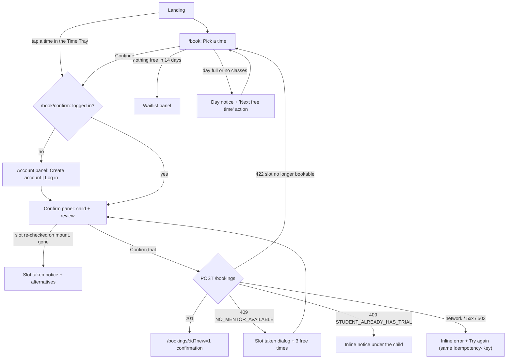
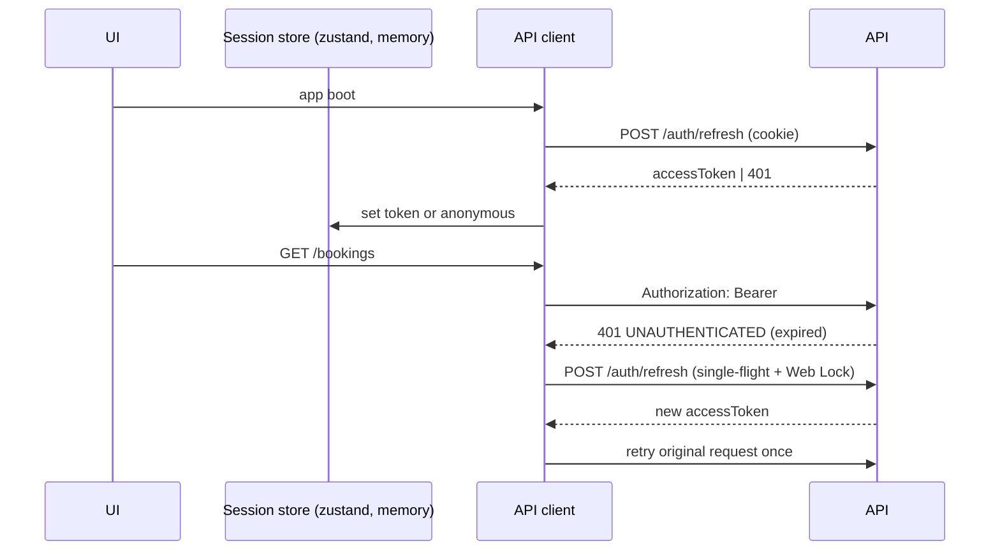

# 05 - Frontend Design (React + Vite)

> Status: **Final for MVP.**
> Screens, flows, architecture and behaviour. Visual language, motion and copy rules live in
> [07 - Design system](07-design-system.md); every screen below follows it.

## 1. Goals

1. A parent on a phone goes from landing page to confirmed trial in **under 2 minutes**, sign-up included.
2. A parent is **never unsure which time zone** a time is in.
3. "No mentor available" is always a guided state with a next step, never a dead end.
4. Refresh, back button and shared links always work: wizard state lives in the URL.
5. It feels **native on a phone** and **crafted on desktop**: instant feedback, no layout jumps, no generic template tells.
6. Secure by default: no tokens in storage, no open redirects, no data leaking between users after logout.

## 2. Tech stack

Library picks follow the curated `pick-ui-library` list; nothing is added without a job to do.

| Concern | Choice | Why |
|---------|--------|-----|
| Build | Vite + React 19 + TypeScript strict | Dev proxy `/api -> http://localhost:3000` keeps SPA and API same-origin for the refresh cookie. |
| Routing | React Router (`createBrowserRouter`, lazy route modules) | Routing and code splitting only; data lives in TanStack Query. |
| Server state | TanStack Query v5 | Caching, retries, invalidation, explicit loading/error states. |
| Client state | zustand | Session store (in-memory access token) and UI preferences. Small, no provider tree. |
| Forms | React Hook Form + zod resolver | Schemas from `@app/contracts`, identical to server validation. |
| Styling | Tailwind CSS v4 (Vite plugin) + CSS variables from doc 07 | Tokens in one place, both themes. |
| Primitives | **Base UI** (verify package name at install, `@base-ui/react`) | Unstyled, accessible dialogs, popovers, menus, combobox, tabs, accordion; exposes `data-starting-style` / `--transform-origin` for correct motion. |
| Variants | cva + clsx | Typed component variants, clean conditional classes. No tailwind-merge (bundle size): variants go through props, `className` only adds layout. |
| Toasts | Sonner (headless `toast.custom`) | One `<Toaster />`, wrapped in our `notify()` API. |
| Icons | Phosphor (`@phosphor-icons/core` SVGs, generated components) | One family, regular weight only; the React package ships all six weights per icon. |
| Countdown | NumberFlow (`@number-flow/react`) | Proper digit transitions, reduced-motion aware. |
| Motion | CSS transitions, `@starting-style`, Base UI data attributes | Cheapest tool that works; no Motion library in MVP (doc 07 §7.2). |
| Time | `@app/time` (Temporal polyfill) + `Intl.DateTimeFormat` | Same formatters as email templates. |
| Fonts | Figtree Variable and JetBrains Mono (`@fontsource-variable`, bundled; ADR 0016) | No third-party font requests. |
| Testing | Vitest + RTL + MSW, Playwright + axe | See §13. |

## 3. Information architecture & routes

| Path | Screen | Access |
|------|--------|--------|
| `/` | Landing | public |
| `/book?tz=&date=&slot=` | Pick a time | public |
| `/book/confirm?slot=&tz=` | Account (inline, skipped if logged in) then Confirm | public shell, auth inside |
| `/login?returnTo=` · `/register?returnTo=` | Auth pages | guest only |
| `/forgot-password` · `/reset-password?token=` | Password recovery | guest only |
| `/bookings` | My bookings (Upcoming / Past) | auth |
| `/bookings/:id` | Booking detail (`?new=1` confirmation, `?moved=1` reschedule notice) | auth |
| `/bookings/:id/reschedule` | Pick a new time | auth |
| `/account` | Profile, Children, Password | auth |
| `/class/:joinToken` | Demo classroom | token |
| `*` | Not found | |

**Header** (64px, sticky, translucent surface with blur; solid under `prefers-reduced-transparency`;
hairline appears only once content scrolls under it): wordmark left; right side: zone chip,
"My bookings" (logged in), account menu with initials avatar (Account, Theme, Log out) or "Log in",
and the primary "Book a free trial" button on pages that are not already the booking flow.
Mobile: wordmark, zone chip, menu button opening a bottom sheet with the same items.

**Footer:** support email, privacy, terms, theme switch (System / Light / Dark).

## 4. Landing page (`/`)

Design-taste rules apply here (landing surface): dials 6 / 4 / 3, no centered hero, max one eyebrow
(we use none), each section a different layout family, no fake screenshots.

| # | Section | Layout family | Content |
|---|---------|---------------|---------|
| 1 | **Hero** | Asymmetric split (7 / 5 columns) | Left: headline, subtext (18 words), one CTA "Book a free trial". Right: the **live Time Tray** "Next free times in London time (GMT+1)" listing the next 4 bookable times (tap one to jump straight to Confirm with it selected) and a "See all times" link. Skeleton while loading; if nothing is free: "All trial classes for the next two weeks are taken" + "Join the waitlist". Fits the first viewport on a 375x667 phone with the CTA visible. |
| 2 | **How the trial works** | Vertical timeline + photo (5 / 7) | Three entries titled by action, not step numbers: "Choose a time", "Join the class", "Get a learning plan". One sentence each. Photo asset #1 on the right (desktop), below on mobile. |
| 3 | **Your time, not ours** | Full-width sunken band with a live readout | Headline "Every time is shown in your time zone". Two readouts joined by a thin line: "Your class: Sat 5:00 PM London time" and "Your mentor: Sat 9:30 PM India time", computed live for the visitor's zone and the next free slot. One sentence: "When clocks change, your booking and emails change with them." |
| 4 | **Questions** | Narrow heading column + accordion | Is it really free? How long is the class? What does my child need? Can I reschedule? Which ages is it for? |
| 5 | **Closing CTA** | Left-aligned statement strip | "Ready when you are." + "Book a free trial" (same label as hero). |

Family hours (PD-39): the hero Time Tray and the section 3 readout prefer slots that start from 07:00 and
before 21:00 in the display zone (`FAMILY_HOURS`), because IST mentor windows put many slots in the small
hours for US families and "4:00 AM" as a first impression reads as "not for us". With no such slot in the
horizon they fall back to the plain next times. Pick a time always lists every slot, Night group included.

Motion: hero entrance and once-only section reveals (doc 07 §7.3 rows 19, 20). Nothing loops.

```
┌───────────────────────────────────────────────────────────────────────┐
│ codeyoung                       London time (GMT+1)   Log in  [Book a free trial] │
├───────────────────────────────────────────────────────────────────────┤
│                                          ╭──────────────────────────╮ │
│  Book a free coding class                │ ╭──────────────────────╮ │ │
│  for your child                          │ │ Next free times       │ │ │
│                                          │ │ London time (GMT+1)   │ │ │
│  Choose a time in your time zone and     │ │                       │ │ │
│  your child gets a live one-on-one       │ │ Sat 24 Oct   5:00 PM  │ │ │
│  class with a mentor.                    │ │ Sat 24 Oct   6:30 PM  │ │ │
│                                          │ │ Tue 27 Oct   5:00 PM  │ │ │
│  [ Book a free trial ]                   │ │ Wed 28 Oct   4:30 PM  │ │ │
│                                          │ │ See all times  →      │ │ │
│                                          │ ╰──────────────────────╯ │ │
│                                          ╰──────────────────────────╯ │
└───────────────────────────────────────────────────────────────────────┘
```

## 5. Booking flow



Stepper labels: **Time**, **Account**, **Confirm** (Account auto-completes for logged-in parents).

### 5.1 Pick a time (`/book`)

**Desktop (>= 1024px):** asymmetric split, 8 / 4 columns.
- Left: page title "Pick a time", zone chip, optional DST notice, date strip, slot grid.
- Right: sticky **Time Tray** summary. Empty state inside it: "Choose a time to see it here." Once a slot
  is chosen: date, `time-xl` time, "5:00 to 6:00 PM London time", "60 min live class, free", primary "Continue".

**Mobile:** single column. The tray becomes a **sticky bottom bar** (safe-area aware) that slides up on
the first selection: "Sat 24 Oct, 5:00 PM" + "Continue".

```
┌────────────────────────────────────────────────┬──────────────────────────┐
│ Pick a time                                     │ ╭──────────────────────╮ │
│ [London time (GMT+1)]                           │ │ Saturday 24 October  │ │
│ ⓘ Clocks in London go back one hour on Sunday   │ │ 5:00 PM              │ │
│   25 October. Times after that are adjusted.    │ │ 5:00 to 6:00 PM      │ │
│                                                 │ │ London time          │ │
│ ‹ [Sat 24 ][Sun 25 ][Mon 26 ][Tue 27 ][Wed 28 ]›│ │ 60 min live class    │ │
│   4 times   Full     No classes 3 times  5 times│ │                      │ │
│                                                 │ │ [ Continue ]         │ │
│ Afternoon                                       │ ╰──────────────────────╯ │
│ [ 4:00 PM ] [ 4:30 PM ] [✓5:00 PM ]             │                          │
│ Evening                                         │                          │
│ [ 6:00 PM ] [ 7:30 PM ]                         │                          │
└────────────────────────────────────────────────┴──────────────────────────┘
```

Behaviour:
- **Date strip:** 14 date chips in the parent's zone, native horizontal scroll with snap. Unavailable
  days stay visible and focusable (they show why). Default selection: `?date`, else first day with times.
- **Slot grid:** grouped Night (00:00 to 05:59) / Morning / Afternoon / Evening by local hour (Night exists because
  IST mentor windows put some slots after midnight for US and UK parents, PD-31); 2 columns under 480px, 3 up to
  768px, 4 to 5 above. Radiogroup semantics, arrow keys move selection (no animation when keyboard-driven).
- **Day notices** (inside the grid area, composed empty state):
  - Full: "Every mentor is booked on Sunday 25 October." + action "Next free time: Tue 27 Oct, 5:00 PM".
  - No classes: "There are no trial classes on Monday 26 October." + same action.
  - The action switches the date and preselects that time.
- **Whole window empty:** "All trial classes for the next two weeks are taken" + "Join the waitlist and we
  will email you as soon as a time opens up." + inline waitlist form (prefilled when logged in).
- **Freshness:** `staleTime` 30s, refetch on focus and every 60s while visible. If the selected time
  disappears: deselect, toast "That time was just booked. Please choose another."
- **Loading:** skeleton date chips and grid. **Error:** inline notice "We couldn't load available times."
  + "Try again".

### 5.2 Account panel (`/book/confirm`, logged out)

- Desktop keeps the same 8 / 4 split: Time Tray on the right (with "Change time" link), panel on the left.
  Mobile shows a compact summary row at the top.
- Tabs **Create account** (default: most trial parents are new) and **Log in** (clip-path indicator).
  - Create account: full name, email, password (live checklist), phone (optional), time zone (prefilled
    with the current display zone). Button "Create account".
  - Log in: email, password, "Forgot password?" (keeps `returnTo`). Button "Log in".
- On success the Account panel swaps to the Confirm panel in place (doc 07 row 12). The slot is never lost.

### 5.3 Confirm panel

```
┌────────────────────────────────────────────────┬──────────────────────────┐
│ Who is the class for?                           │ ╭──────────────────────╮ │
│ (●) Leo, 9                                      │ │ Saturday 24 October  │ │
│ ( ) Maya, 12                                    │ │ 5:00 PM              │ │
│     Maya already has a trial on Tue 27 Oct.     │ │ London time (GMT+1)  │ │
│     View booking                                │ │ Change time          │ │
│ ( ) Add a child  [First name     ] [Age ▾]      │ ╰──────────────────────╯ │
│                                                 │                          │
│ ⚠ Your profile uses New York time. We will     │                          │
│   switch it to London time so your emails match.│                          │
│                                                 │                          │
│ [ Confirm trial ]                               │                          │
└────────────────────────────────────────────────┴──────────────────────────┘
```

- Children from `GET /me/students`. A child with an upcoming trial is disabled with the inline reason and a link.
- **Zone checks:** chosen zone differs from profile zone: caution notice (server updates the profile, A-11).
  Chosen zone differs from the device zone: caution notice "Your device is set to New York time. Are you
  booking in London time?" with a one-tap switch.
- **Re-validate on mount:** refetch that day's slots; if the time is gone, show the slot-taken notice with
  alternatives before the parent clicks anything.
- **Idempotency:** a UUID key per (slot, child) selection, kept in `sessionStorage`, reused on retry or
  refresh, replaced when slot or child changes.
- **Submit:** button enters pending state (label kept, width locked). On `201`:
  `navigate('/bookings/:id?new=1', { replace: true })`, invalidate `slots`, `bookings`, `students`, `me`.

### 5.4 Error mapping

| API code | UI |
|----------|----|
| `NO_MENTOR_AVAILABLE` | Dialog (sheet on mobile): "That time was just booked by another family. These times are still free:" + up to 3 time buttons in the parent's zone + "See all times". Picking one updates `?slot` and issues a new idempotency key. |
| `STUDENT_ALREADY_HAS_TRIAL` | Inline notice under the child with "View booking". |
| `SLOT_IN_PAST` / `SLOT_OUTSIDE_HORIZON` / `SLOT_NOT_ON_GRID` | Toast "That time can no longer be booked." then back to Pick a time on the same day. |
| `INVALID_TIMEZONE` | Reset to device zone, toast. (Should not happen from the UI.) |
| `RATE_LIMITED` | Inline: "Too many attempts. Try again in 30 seconds." (from `Retry-After`, counting down). |
| `TEMPORARILY_UNAVAILABLE`, network, 5xx | Inline danger notice: "We couldn't reach our servers. Check your connection and try again." + "Try again" (same key) + reference (`traceId`). |

## 6. Booking confirmation, My bookings, detail, reschedule

### 6.1 Confirmation (`/bookings/:id?new=1`)

- Confirmed mark (doc 07 row 16), headline "Leo's trial is booked", body "Saturday 24 October, 5:00 PM
  London time. We have emailed the details to hannah@okafor.co.uk."
- Actions: **Add to calendar** (primary, menu: Google Calendar, Apple / Outlook (.ics)), **Copy class link**
  (secondary, icon morph feedback).
- Details panel: reference `CY-7K3Q9P` (mono, selectable), child, mentor ("Priya"), time with zone switch
  ("View in another time zone").
- "Before the class": device with camera and microphone, a quiet spot, join 5 minutes early.

### 6.2 My bookings (`/bookings`)

- Tabs Upcoming / Past. Rows (not heavy cards, 12px gap, no per-row hairlines stacked):

```
 ┌──────┐
 │  24  │  Sat, 5:00 PM London time        [Confirmed]
 │ OCT  │  Leo with Priya    Ref CY-7K3Q9P
 └──────┘  [Join class]  [Add to calendar ▾]  [···]
```

- `···` menu: Reschedule, Cancel (danger). "Join class" is primary only inside the class window
  (10 minutes before start to end), secondary otherwise.
- Empty Upcoming: "No trial booked yet." + "Book a free trial". Cursor pagination "Show more".

### 6.3 Detail (`/bookings/:id`)

- Same content as the confirmation minus the hero. `?moved=1` shows notice "Your trial has moved to Tue 27 Oct, 5:00 PM."
- **Cancel:** dialog "Cancel Leo's trial on Sat 24 Oct? The time will be offered to another family."
  optional reason select, buttons "Keep booking" / "Cancel trial" (danger). Success toast "Trial cancelled".
- **Reschedule** disabled after the cutoff with the reason visible: "Trials can be moved up to 2 hours before they start."
- Cancelled / moved / completed bookings render read-only; moved shows "Moved to Tue 27 Oct" linking to the new booking.
- **Download .ics** uses an authenticated fetch into a Blob (the endpoint needs the Bearer token).

### 6.4 Reschedule (`/bookings/:id/reschedule`)

- Notice at top: "Moving Leo's trial from Sat 24 Oct, 5:00 PM."
- Same Pick a time component; the current time is marked "Current" and not selectable.
- Tray action "Move trial" opens a confirm dialog "Sat 24 Oct, 5:00 PM to Tue 27 Oct, 5:00 PM" then
  `POST /reschedule` (own idempotency key) and navigates to `/bookings/:newId?moved=1`. Conflicts as §5.4.

## 7. Demo classroom (`/class/:joinToken`)

Focused, centered utility page (the one place centered layout is right: a single task).

| State | Window | UI |
|-------|--------|----|
| Upcoming | More than 10 min before start | Class title, time in viewer's zone with zone chip, NumberFlow countdown, "The classroom opens 10 minutes before the class." |
| Open | 10 min before start until end | "Live" indicator (the product's only pulsing element), "Join class" enters the demo room: two video tiles (mentor and student initials), "This is a demo classroom" notice. |
| Ended | After end | "This class has ended." Parent link: "Book another trial". |
| Cancelled / Moved | | Clear message; parent sees "Go to My bookings". |
| Invalid | | "This class link isn't valid. Check the link in your email." |

Viewer zone defaults to the device zone (the viewer may be the mentor). Countdown corrects device clock
skew using `serverTime`.

## 8. Account (`/account`)

Desktop: left sub-navigation (Profile, Children, Password) + content. Mobile: stacked sections.
- **Profile:** full name, phone, time zone (picker). Email read-only.
- **Children:** list, add, edit (first name, age).
- **Password:** current, new (checklist). Success toast "Password changed. Other devices have been logged out."

## 9. Auth pages

Desktop: split layout, form column (max 400px) left, photo asset #2 right. Mobile: form only.

| Screen | Behaviour |
|--------|-----------|
| Log in | Email, password (show/hide), "Forgot password?". `INVALID_CREDENTIALS`: "That email and password don't match." `ACCOUNT_TEMPORARILY_LOCKED`: "Too many attempts. Try again in 12 minutes." |
| Create account | Name, email, password with checklist, phone optional, zone prefilled. `EMAIL_ALREADY_REGISTERED`: "An account with this email already exists." + "Log in" / "Reset password" (both keep `returnTo`). `WEAK_PASSWORD`: server reason under the field. |
| Forgot password | Email, then always: "If an account exists for that email, we have sent a reset link." |
| Reset password | New password + confirm. Token read from the URL then removed via `history.replaceState`. Success: `/login` + toast "Password updated. Please log in." `RESET_TOKEN_INVALID`: "This link has expired or was already used." + "Send a new link". |

`returnTo` accepted only if it is a relative path starting with `/` and not `//` (no open redirects).

## 10. Session management (client)



- **Access token in memory only** (zustand store); the refresh token is the httpOnly cookie JS never sees.
- **Boot:** silent refresh. Public routes render immediately; protected routes show their skeleton until auth resolves.
- **Proactive refresh** 60s before `exp`; **reactive refresh** on `401 UNAUTHENTICATED`, then one retry.
- **Single-flight:** one refresh promise per tab; across tabs via `navigator.locks.request('cy-refresh')`
  (per-tab fallback); the server's 20s grace covers the rest.
- **Cross-tab sync:** `BroadcastChannel('cy-auth')`: logout in one tab clears the others; login refreshes them.
- **Logout:** `POST /auth/logout`, clear token, `queryClient.clear()`, broadcast, go to `/`.
- **Refresh failure:** clear state, `/login?returnTo=<current>`, notice "You were logged out. Log in again to continue."
- **Guards:** `<RequireAuth>` (redirect with `returnTo`), `<GuestOnly>` (logged-in users go to `/bookings`).

## 11. Time-zone UX

- **Display zone resolution:** `?tz` in URL, then a zone picked during this visit, then profile zone
  (logged in), then saved preference (`localStorage`, try/catch), then device zone
  (`Intl.DateTimeFormat().resolvedOptions().timeZone`), then UTC. Ids are canonicalised first
  (`Asia/Calcutta` becomes `Asia/Kolkata`). A pick made this visit must win over the profile, or
  choosing "Just for now" in the profile prompt would appear to do nothing.
- **Zone label** (`zoneLabel(zone, instant)` in `@app/time`, shared with emails): US zones use the generic
  name ("Eastern Time (GMT-4)"), others the city ("London time (GMT+1)", "Kolkata time (GMT+5:30)").
  Offsets computed for the dates on screen, so after 25 Oct the label reads "London time (GMT)".
- **Zone chip** on every time-bearing screen; changing zone while logged in asks
  "Also save London as your profile time zone?"
- **Formatting:** device locale decides style (en-GB 17:00, en-US 5:00 PM); tabular figures; ranges through
  our own formatter ("5:00 to 6:00 PM"), never `formatRange` (en dash).
- `<LocalTime instant zone variant="date | time | dateTime | range" />` renders `<time dateTime="...Z">`.
- DST notice when the slots response includes a transition; zone-mismatch notice on Confirm.
- ESLint forbids `new Date(string)` and `Date#get*` outside `features/timezone`.

## 12. SPA architecture

```
apps/web/
├── index.html                  # viewport/theme-color meta, no-flash theme script, font preload
├── vite.config.ts              # /api proxy, aliases, Tailwind plugin
├── e2e/                        # Playwright
└── src/
    ├── main.tsx
    ├── app/                    # providers, router, AppShell (header/footer), RouteError, NotFound
    ├── routes/                 # one lazy module per route; thin, compose features
    ├── features/
    │   ├── auth/               # session store, api, AccountPanel, forms, guards, returnTo sanitiser
    │   ├── timezone/           # TimezoneProvider, ZoneChip, ZonePicker, LocalTime, DstNotice
    │   ├── availability/       # useSlots, DateStrip, SlotGrid, DayNotice, TimeTray (shared by book + reschedule + landing)
    │   ├── booking/            # wizard, ChildPicker, ConfirmPanel, SlotTakenDialog, useCreateBooking
    │   ├── my-bookings/        # list, row, detail, CancelDialog, reschedule flow, CalendarMenu
    │   ├── account/            # ProfileForm, ChildrenManager, ChangePasswordForm
    │   ├── classroom/          # ClassroomPage, Countdown, DemoRoom
    │   ├── waitlist/           # WaitlistForm
    │   └── landing/            # Hero, HowItWorks, TimeReadout, Faq, ClosingCta
    ├── shared/
    │   ├── api/                # client, ApiError, queryClient, queryKeys
    │   ├── ui/                 # design-system components (doc 07 §6) on Base UI + cva
    │   ├── hooks/ · lib/
    └── styles/                 # tokens.css (both themes), motion.css, base.css (mobile baseline)
```

Rules: features import `shared/*` and other features' public `index.ts` only; routes compose features;
nothing imports from `routes/` or `app/`. Enforced with ESLint `import/no-restricted-paths`.

### 12.1 API client

- `api<T>(path, { method, body, schema, auth = true, idempotencyKey, signal })`: base `/api/v1`, JSON,
  Bearer from the store, `X-Requested-With: cy-web` on cookie-authenticated auth calls, refresh-and-retry on 401.
- Non-2xx becomes `ApiError { status, code, title, detail, errors, retryAfter, traceId, extras }`. UI branches on `code` only.
- Responses parsed with shared zod schemas in development and tests (throw on mismatch); production is a
  typed pass-through so zod stays out of routes without forms (PD-24). Call sites pass
  `schema: import.meta.env.DEV ? XSchema : undefined`, which production builds remove.
- Query defaults: GET retries x2 on network/5xx (never 4xx); mutations never auto-retry.
- Key factory: `qk.slots(from, days, tz)`, `qk.bookings(scope)`, `qk.booking(id)`, `qk.me()`, `qk.students()`, `qk.classroom(token)`, `qk.meta.*`.

### 12.2 State ownership

| State | Owner |
|-------|-------|
| Server data | TanStack Query |
| Wizard (tz, date, slot) | URL search params, parsed with zod (invalid values fall back to defaults) |
| Form state | React Hook Form |
| Session | zustand store (memory) + httpOnly cookie |
| Display zone, theme | `TimezoneProvider` / theme store (URL, profile, localStorage, device) |
| Idempotency keys | `sessionStorage` per selection |
| Business config (duration, horizon, cutoffs) | `GET /meta/booking-config`, never hard-coded |

### 12.3 Accessibility (WCAG 2.1 AA)

- Date strip and slot grid are `radiogroup`s: one tab stop each, arrow keys inside.
- Focus moves to the page `<h1>` on route change; dialogs trap and restore focus (Base UI).
- Errors inline with `aria-describedby`; an error summary on submit; `aria-live="polite"` for async results.
- 44px minimum targets, visible focus rings (2px accent + 2px offset), contrast per doc 07 §2.
- Reduced motion, reduced transparency and increased contrast all honoured (doc 07).

### 12.4 Performance

- Initial JS <= 180 KB gzip (route-level splitting; classroom, account, auth, reschedule lazy). `npm run build -w @app/web`
  fails when the entry plus a route's chunks and modulepreloads exceed it (`scripts/bundle-budget.mjs`).
- LCP < 2.5s on a mid-range phone, INP < 200ms, CLS < 0.1 (font metric overrides, reserved image boxes,
  skeletons with final dimensions, pending buttons with locked width).
- Slots prefetched when the landing CTA is hovered or focused; the hero Time Tray query shares the cache with `/book`.
- Lighthouse >= 90 (performance, accessibility, best practices).

### 12.5 Resilience

- Route-level error boundaries: "This page failed to load." + "Try again" + reference `traceId`.
- Offline banner (`navigator.onLine`) disables submit buttons with the reason.

## 13. Testing

| Level | Tooling | Focus |
|-------|---------|-------|
| Unit | Vitest | URL-state parsers, zone resolution order, `zoneLabel`, range formatter (no dashes), `returnTo` sanitiser, error mapping, idempotency-key store. |
| Component | RTL + MSW (handlers from contract fixtures) | Pick a time states (loading, full day, no classes, window empty, DST notice, stale slot), Account panel, child picker, slot-taken dialog, cancel/reschedule dialogs, refresh-and-retry in the client. |
| E2E | Playwright against real API + Mailpit | Register and book in `Europe/London`; parent and mentor emails show London and IST times; same in `America/Los_Angeles`; race (two contexts, one slot left) shows the dialog; reschedule; cancel; forgot/reset via Mailpit; session survives reload; logout clears data. |
| a11y | `@axe-core/playwright` | No serious or critical violations on any route, both themes. |
| Visual | Playwright screenshots at 375px and 1280px, light and dark | Key screens attached to PRs (not diff-gated in MVP). |
| Copy lint | Unit test over locale strings | Fails on em/en dashes, emojis, banned filler words. |
| Motion | `review-animations` bar in PR review | Every animation matches doc 07 §7.3. |
